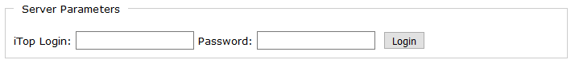

# simple-itop-ui
A simple UI for iTop.
  
You use [iTop](https://www.combodo.com/itop) as your internal CMDB with the following structure :
* Location -> Rack -> Server
* Location -> Rack -> Enclosure -> Server


This project will give you a simple page to show your datacenter and navigate between racks :
* on the left, all racks of your location
* on the right, the detail of each U of each rack


### Authentication
Authentication based on iTop.



### Installing
Copy file on your website server.
Modify <js/properties.js> to update your iTop webservice url.

A simple URL :
```
https://yourdomain/simple-itop-ui/datacenter.html?id=NAME_OF_YOUR_LOCATION
```

Also existing a page for showing a single rack.
```
https://yourdomain/simple-itop-ui/rack.html?id=NAME_OF_YOUR_RACK
```

## Authors
* **Christophe** - *Initial work* - [khrys63](https://github.com/khrys63)
* **Sylvain Desgrais** - [Artpej](https://github.com/Artpej)


## License
This project is licensed under Apache 2.0.


## Contributing
We welcome contributions from the community!