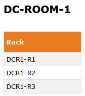
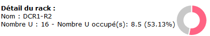
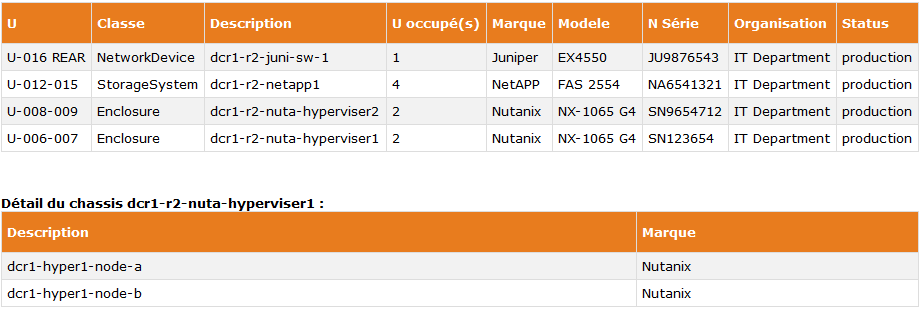
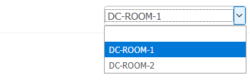
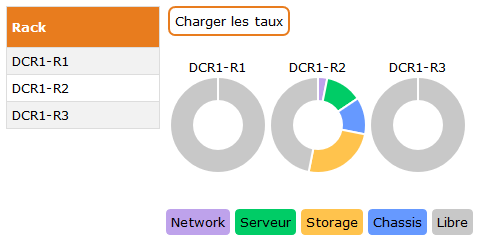
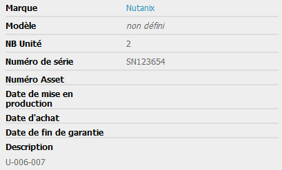

# simple-itop-ui
A simple UI for iTop.
  
You use [iTop](https://www.combodo.com/itop) ([iTop on GitHub](https://github.com/Combodo/iTop)) as your internal CMDB with the following structure :
* Location -> Rack -> Server
* Location -> Rack -> Enclosure -> Server
* Location -> Rack -> Enclosure -> NetworkDevice

This project will give you a simple page to show your datacenter and navigate between racks :
* on the left, all racks of your location
* on the right, the detail of each U of each rack and the content of each enclosure

### Authentication
Authentication based on iTop.


Warning : 
- The REST/JSON API requires iTop 2.0.1 or newer.
- The REST/JSON API is restricted in iTop 2.5 or newer to the users having the profile REST Services User.

### Installing
Copy file on your website server.

Modify <js/properties.js> to update your iTop webservice url in getITopUrl() function.

If you have more than one room in your data center,

Modify <js/properties.js> to specify them datacenter JSON object.

You can choose interface language beetwen en(english) or fr(french).

Modify <js/properties.js> to specify en / fr in getLanguage() function.

Put your logo in .

### Browsing & Enjoy
A simple URL :
```
https://yourdomain/simple-itop-ui/datacenter.html?id=NAME_OF_YOUR_LOCATION
```

On the left, you'll find all racks of the specified location :



After choosing a rack, its detail appeares on the right, with occupied space chart :



Under this detail, you'll find all servers and enclosures, and you can select an enclosure ti show its internal detail :



On the top right corner, you'll find a combobox to switch location :



On the main page of a location, you can see the occupied space of all rack, with detail percent bu clicking on the <Charger les taux> button :




Also existing a page for showing a single rack.
```
https://yourdomain/simple-itop-ui/rack.html?id=NAME_OF_YOUR_RACK
```

### Practice in iTop
For a good order of each Server or Enclosure in the Rack, you must specify the location in the Description field.

Format is <U-From-To> with 3 digits.

Examples :
```
U-001-001
U-010-011
U-020-027
```



## Debuging in real time
For an easy view of the Rest Response, configure <js/properties.js> to activate the JSON viewer (function getIsDebugJSONVisible).

## Authors
* **Christophe** - *Initial work* - [khrys63](https://github.com/khrys63)
* **Sylvain Desgrais** - [Artpej](https://github.com/Artpej)

## Thanks
* **Chart.js** - [Chart.js](https://github.com/chartjs/Chart.js), Simple HTML5 Charts using the canvas element.
* **i18njs** - [i18njs]( https://github.com/roddeh/i18njs), Internationalisation library for JS projects.

## License
This project is licensed under Apache 2.0.

## Contributing
We welcome contributions from the community!